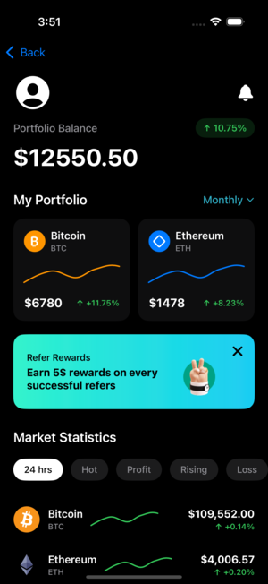

# CryptoPriceTracker 📈

A modern iOS cryptocurrency price tracking app built with SwiftUI, RxSwift, and clean architecture principles.

## App Preview

| Welcome Screen | Market Overview | Coin Detail |
|:---:|:---:|:---:|
|  |  |  |
| Onboarding with 3D illustration | Live crypto prices & portfolio | Interactive charts & favorites |

## Features

- **Real-time Market Data** - Live cryptocurrency prices from CoinGecko API
- **Portfolio Overview** - Track your crypto holdings with visual charts
- **Price Charts** - Interactive 7-day, 1-month, and 1-year price charts
- **Favorites System** - Save and manage favorite cryptocurrencies with CoreData
- **Reactive UI** - Smooth, responsive interface with RxSwift data streams

## How to Use

1. **Welcome Screen** - Tap "Get Started" to enter the app
2. **Market Overview** - Browse live crypto prices, pull down to refresh
3. **Coin Details** - Tap any coin to view detailed information
4. **Price Charts** - Switch between 1W, 1M, 1Y timeframes
5. **Favorites** - Tap the heart icon to save/remove favorites (persists locally)
6. **Portfolio** - View mock portfolio cards (demo data)

## Tech Stack

- **UI**: SwiftUI, Custom Charts, Pull-to-refresh
- **Architecture**: MVVM + Clean Architecture (UseCase + Repository)
- **Reactive**: RxSwift/RxCocoa for data flow and state management
- **Networking**: Alamofire with reactive wrappers
- **Persistence**: CoreData for favorites storage
- **API**: CoinGecko public API (no auth required)

## Architecture

```
┌─ Presentation Layer (SwiftUI Views + ViewModels)
├─ Domain Layer (UseCases + Models + Protocols)
└─ Data Layer (Repository + Remote/Local DataSources)
```

**Key Components:**
- **ViewModels**: RxSwift Drivers for UI state management
- **UseCases**: Business logic isolation (FetchMarkets, ToggleFavorite)
- **Repository**: Data abstraction (API + CoreData)
- **Dependency Injection**: Clean, testable architecture

## API Endpoints

- Markets: `GET /api/v3/coins/markets`
- Coin Detail: `GET /api/v3/coins/{id}`
- Price Chart: `GET /api/v3/coins/{id}/market_chart`

## Setup

1. Clone repository
2. Open `CryptoPriceTracker.xcodeproj`
3. Build and run (iOS 17+, Xcode 15+)

*No API keys or external setup required*

## Key Learnings

- Reactive programming patterns with RxSwift
- Clean architecture implementation in iOS
- CoreData integration with reactive streams
- Custom SwiftUI chart components
- Error handling and loading states
